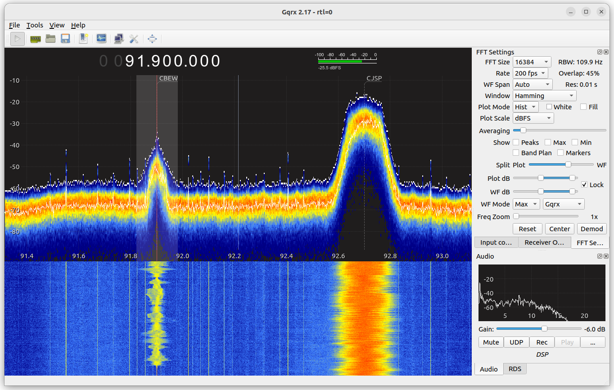

Gqrx
====

[](https://github.com/gqrx-sdr/gqrx/actions?query=workflow%3ACI+branch%3Amaster)
[](https://github.com/gqrx-sdr/gqrx/actions?query=workflow%3ABuild+branch%3Amaster)

Gqrx is an open source software defined radio (SDR) receiver implemented using [GNU Radio](https://gnuradio.org) and the [Qt GUI toolkit](https://www.qt.io/).
Currently it works on Linux and Mac with hardware supported by gr-osmosdr, including Funcube Dongle, RTL-SDR, Airspy, HackRF, BladeRF, RFSpace, USRP and SoapySDR.

Gqrx can operate as an AM/FM/SSB receiver with audio output or as an FFT-only instrument. There are also various hooks for interacting with external
applications using network sockets.




Download
========

Gqrx is distributed as a source code package and binaries for Linux and Mac. Many Linux distributions provide gqrx in their package repositories.

* [Official releases](https://github.com/gqrx-sdr/gqrx/releases)
* [Pre-release builds](https://github.com/gqrx-sdr/gqrx/actions?query=workflow%3ABuild+branch%3Amaster)

Alternate Mac support is available through [MacPorts](https://ports.macports.org/port/gqrx/summary) and [Homebrew](https://formulae.brew.sh/cask/gqrx).

Installation 
============

Our installation instructions cover Linux, Mac OS, Raspberry-Pi, and source code. If you're installation option is not available here, you can request it via [this 1 question poll](https://poll.fm/11102781).

Linux distributions
-------------------

The simplest installation for Linux distributions is by our [official AppImage release](https://github.com/gqrx-sdr/gqrx/releases). Many Linux distributions provide gqrx in their package repositories. Linux distribution versions can be out-of-date. 

Alternatively you can install from [source code](https://github.com/gqrx-sdr/gqrx/edit/master/README.md#installation-from-source). It will soon be possible to install gqrx on [linux-64, linux-aarch64 via the conda-forge](https://github.com/gqrx-sdr/gqrx/edit/master/README.md#installation-via-conda).

Mac OS install 
--------------

The simplest installation is by our [offical Mac OS release](https://github.com/gqrx-sdr/gqrx/releases).

Alternate Mac support is available through [MacPorts](https://ports.macports.org/port/gqrx/details/) and [Homebrew](https://formulae.brew.sh/cask/gqrx). It will soon be possible to install gqrx on [Mac OS osx-64 via the conda-forge](https://github.com/gqrx-sdr/gqrx/edit/master/README.md#installation-via-conda).

Raspberry-Pi
------------

The simplest installation for Raspberry-Pi devices is via the Raspberry-Pi software repository.

```
open the Applications menu
select Preferences
Add / Remove Software
search for Gqrx
After installation, Gqrx will be available in the Internet section of the Applications menu
```

Alternatively you can install it via [source using the instructions found on this blogpost](https://gqrx.dk/download/gqrx-sdr-for-the-raspberry-pi).

Windows
-------

Right now there is no simple way to install gqrx on Windows. It will soon be possible to install it on [Windows 64 bit (win-64) via the conda-forge](https://github.com/gqrx-sdr/gqrx/edit/master/README.md#installation-via-conda).

Installation via Conda
----------------------

(Note: Installation via Conda is not yet fully supported. It is hoped this will be possible very soon.)

The objective is to make it possible to install gqrx using [the conda-forge package manager](https://anaconda.org/conda-forge/gqrx). When this happens it'll be possible to install gqrx on linux-64, linux-aarch64, osx-64, and win-64.

Installation from source code
-----------------------------

The source code is hosted on Github: https://github.com/gqrx-sdr/gqrx

To compile gqrx from source you need the following dependencies:
- GNU Radio 3.7, 3.8, 3.9, or 3.10 with the following components:
    - gnuradio-runtime
    - gnuradio-analog
    - gnuradio-audio
    - gnuradio-blocks
    - gnuradio-digital
    - gnuradio-fft
    - gnuradio-filter
    - gnuradio-network (GNU Radio 3.10 only)
    - gnuradio-pmt
- The gr-iqbalance library (optional)
- Drivers for the hardware you want to have support for:
    - Funcube Dongle Pro driver via gr-fcd
    - UHD driver via gr-uhd
    - Funcube Dongle Pro+ driver from https://github.com/dl1ksv/gr-fcdproplus
    - RTL-SDR driver from https://gitea.osmocom.org/sdr/rtl-sdr
    - HackRF driver from https://github.com/mossmann/hackrf
    - Airspy driver from https://github.com/airspy/airspyone_host
    - SoapySDR from https://github.com/pothosware/SoapySDR
    - RFSpace driver is built in
- gnuradio-osmosdr from https://gitea.osmocom.org/sdr/gr-osmosdr
- pulseaudio or portaudio (Linux-only and optional)
- Qt 5 with the following components:
    - Core
    - GUI
    - Network
    - Widgets
    - Svg (runtime-only)
- cmake version >= 3.2.0

Gqrx can be compiled from within Qt Creator or in a terminal:

For command line builds:
<pre>
$ git clone https://github.com/gqrx-sdr/gqrx.git gqrx.git
$ cd gqrx.git
$ mkdir build
$ cd build
$ cmake ..
$ make
</pre>
On some systems, the default cmake release builds are "over-optimized" and
perform poorly. In that case try forcing -O2 using
<pre>
export CXXFLAGS=-O2
</pre>
before the cmake step.

For Qt Creator builds:
<pre>
$ git clone https://github.com/gqrx-sdr/gqrx.git gqrx.git
$ cd gqrx.git
$ mkdir build
Start Qt Creator
Open gqrx.git/CMakeLists.txt file
At the dialog asking for build location, select gqrx.git/build
click continue
If asked to choose cmake executable, do so
click continue
click the run cmake button
click done
optionally, on the Projects page, under Build Steps/Make/Additional arguments,
	enter -j4 (replacing 4 with the number of cores in your CPU).
Use Qt Creator as before
</pre>


Usage
=====

First use - optimise
--------------------

It is strongly recommended to run the `volk_profile` utility before
running gqrx. This will detect and enable processor-specific optimisations and
will in many cases give a significant performance boost.

The first time you start gqrx it will open a device configuration dialog.
Supported devices that are connected to the computer are discovered
automatically and you can select any of them in the drop-down list.

If you don't see your device listed in the drop-down list it could be because:
- The driver has not been included in a binary distribution
- The udev rule has not been properly configured
- Linux kernel driver is blocking access to the device

You can test your device using device specific tools, such as rtl_test,
airspy_rx, hackrf_transfer, qthid, etc.

Gqrx supports multiple configurations and sessions if you have several devices
or if you want to use the same device under different configurations. You can
load a configuration from the GUI or using the `-c` command line argument. See
`gqrx --help` for a complete list of command line arguments.

Tutorials and howtos
---------------------

Tutorials and howtos are being written and published on the website
https://gqrx.dk/


Known problems
--------------

See the bug tracker on Github: https://github.com/gqrx-sdr/gqrx/issues


Join the community - Get help, report bugs and contribute
=========================================================

Mail list
---------

There is a Google group for discussing anything related to Gqrx:
https://groups.google.com/g/gqrx

This includes getting help with installation and troubleshooting. Please
remember to provide detailed description of your problem, your setup, what
steps you followed, etc.

Please stick around and help others with their problems. Otherwise, if only
developers provide user support there will be no more time for further
development.

Chat
----

There is a busy [gqrx chat channel hosted](#gqrx:gnuradio.org
) on Gnu Radio matrix. You're welcome to join, then search for #gqrx:gnuradio.org.


Debugging
---------

Debug logging can be enabled by setting the `QT_LOGGING_RULES` environment
variable:

```
QT_LOGGING_RULES="*.debug=true;plotter.debug=false;qt.*.debug=false" gqrx
```

To turn on plotter debugging as well, use the following command:

```
QT_LOGGING_RULES="*.debug=true;qt.*.debug=false" gqrx
```


Credits and License
===================

Gqrx is designed and written by Alexandru Csete OZ9AEC, and it is licensed
under the[ GNU General Public License](https://www.gnu.org/licenses/gpl-3.0.en.html).

Some of the source files were adapted from Cutesdr by Moe Weatley and these
come with a Simplified BSD license.

The following people and organisations have contributed to gqrx:

* Alex Grinkov
* Alexander Fasching
* Andrea Merello
* Andrea Montefusco, IW0HDV
* Andy Sloane
* Anthony Willard
* Anton Blanchard
* Bastian Bloessl
* Ben Reese
* Bob McGwier, N4HY
* Brandonn Etheve
* charlylima
* Chris Kuethe
* Christian Lindner, DL2VCL
* Clayton Smith, VE3IRR
* Dallas Epperson
* Daniil Cherednik
* Darin Franklin
* Davide Gerhard
* Dominic Chen
* Doug Hammond
* Elias Önal
* Federico Fuga
* Frank Brickle, AB2KT
* Frank Werner-Krippendorf, HB9FXQ
* Ganael Laplanche
* Gisle Vanem
* Göran Weinholt, SA6CJK
* Grigory Shipunov
* Gwenhael Goavec-Merou
* Jeff Long
* Jiawei Chen
* Jiří Pinkava
* Joachim Schueth, DL2KCD
* Josh Blum
* Kate Adams
* Kenji Rikitake, JJ1BDX
* Kitware Inc.
* Konrad Beckmann
* luzpaz
* Marco Savelli
* Markus Kolb
* Michael Dickens
* Michael Lass
* Michael Tatarinov
* Moe Weatley
* Nadeem Hasan
* Nate Temple
* Nick Robinson, KE5YWP
* Nokia
* Oliver Grossmann, DH2WQ
* Pavel Milanes, CO7WT
* Pavel Stano
* Phil Vachon
* Radoslav Gerganov
* Rob Frohne
* Ron Economos, W6RZ
* Russell Dwarshuis, KB8U
* Shuyuan Liu
* Stefano Leucci
* Sylvain Munaut
* Tarmo Tanilsoo
* Tomasz Lemiech
* Timothy Reaves
* Valentin Ochs
* Vesa Solonen
* Vincent Pelletier
* Vladisslav P
* Will Scales
* Wolfgang Fritz, DK7OB
* Youssef Touil
* Zero_Chaos

Also thanks to Volker Schroer and Alexey Bazhin for bringing Funcube Dongle
Pro+ support to GNU Radio and Gqrx.

Let me know if somebody is missing from the list.

Alex OZ9AEC

UI Design & iconography
=======================

Some of the icons are from:
- The GNOME icon theme CC-SA 3.0 by GNOME icon artists
- [Tango icon theme](https://en.wikipedia.org/wiki/Tango_Desktop_Project), Public Domain by The people from the Tango! project
- [Mint-X icon theme](https://github.com/linuxmint/mint-x-icons), GPL by Clement Lefebvre
